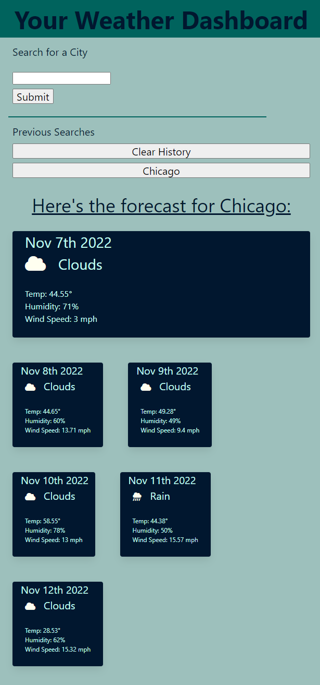

# Weather Dashboard

This project uses the OpenWeather API to allow the user to search for a city and display both the current weather in that city as well as a five day forecast. Recent searches are stored in local storage and displayed in a list for easy access.

## Installation

N/A

## Usage

[Live website](https://aknoedler.github.io/weather-dashboard/)

Enter a city into the search field, or click on a previously searched city to display the forecast.

## Screenshots

## Contributing

N/A

## License

N/A